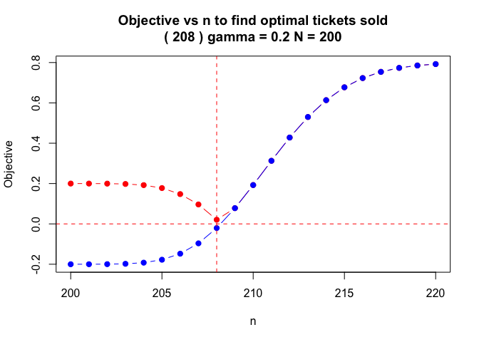

<!-- README.md is generated from README.Rmd. Please edit that file -->

# MATH4753KORBProject1

<!-- badges: start -->

<!-- badges: end -->

The MATH4753KORBProject1 package provides tools for modeling and solving
overbooking problems using both discrete and continuous methods. It’s
especially useful in industries like airlines, hospitality, and
ticketing where no-shows are expected, and overselling requires a
careful balance of risk and reward.

Functions:

- optimal_n_discrete(): Computes the optimal overbooking amount using a
  discrete probability distribution.
- optimal_n_continuous(): Uses continuous approximations for efficiency
  in large-scale settings.
- optimal_n(): A unified interface for both methods, also powering a
  Shiny app for interactive exploration.

## Installation

You can install the development version of MATH4753KORBProject1 from
[GitHub](https://github.com/) with:

``` r
# install.packages("pak")
pak::pak("kkorb21/MATH4753KORBProject1")
```

## Example

This is a basic example which shows you how to solve a common problem:

``` r
library(MATH4753KORBProject1)

# Optimal number of tickets to sell with given parameters
optimal_n_discrete(N = 200, p = 0.95, gamma = 0.2, n_range = 200:220)
```



    #> [1] 208
